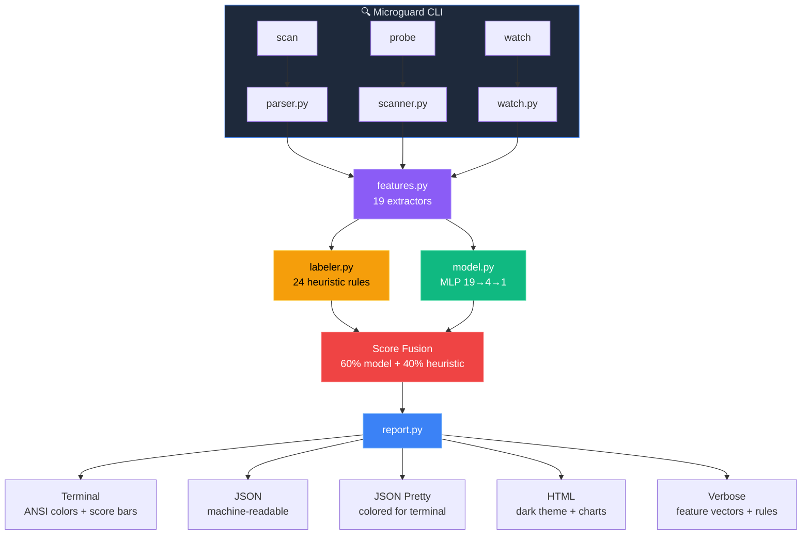
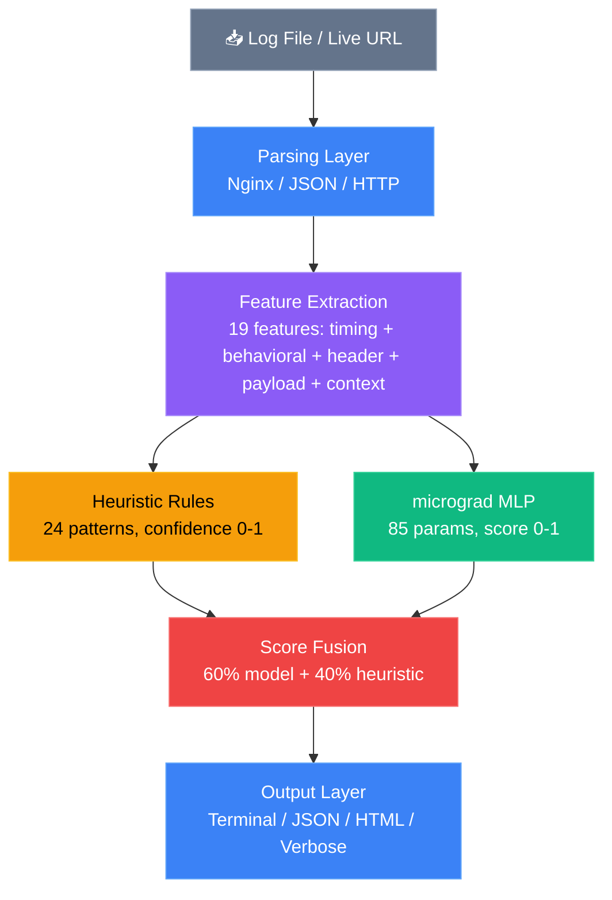
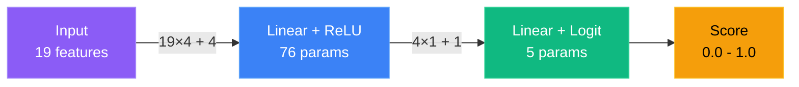

# 🔍 Microguard

**Bot Traffic Audit Tool powered by micrograd** · v2.0.0-beta

Detect malicious bot traffic in your API logs and live endpoints. Zero external dependencies beyond micrograd.

> **Beta:** trained on real ground-truth attack data (not synthetic), but not
> yet adversarially tested. See [Known Limitations](#known-limitations-read-before-relying-on-this-for-production-blocking)
> before using this as a production blocking gate.

```
$ microguard scan access.log

  Microguard Bot Traffic Report
  ─────────────────────────────

  🚨 Bot Traffic: 50.0%  CRITICAL

  Total sessions:  4
  Human sessions:  2
  Bot sessions:    2

  █████░░░░░  50.0%

  IP                 Score Bar          Risk      Label    Reqs    Dur Heuristic Rule
  ─────────────────────────────────────────────────────────────────────────────────────
  10.0.0.50          0.95 █████████░ DANGER    bot     1   0.0s known bot/monitoring UA
  192.168.1.100      0.39 ███░░░░░░░ LOW       human     5  34.0s known browser, reasonable session
```

## Features

- **19 HTTP-level features** for bot detection (timing, behavioral, header analysis) from real access logs — REST-style, path-per-resource traffic
- **Single-endpoint API aware** — GraphQL, SOAP, RPC, and gRPC traffic is exempted from the "same endpoint = scraper" heuristics that would otherwise flag every legitimate client of a single-endpoint API
- **Webhook/integration allowlist** — recognized senders (Stripe, GitHub, Shopify, ...) are labeled `automated-integration`, not scored as malicious bots
- **24+ heuristic rules** across 4 confidence tiers (Cloudflare WAF, API key, botnet detection)
- **micrograd neural network** — 85 parameters, ~1.8KB model size, trained on real ground-truth-labeled attack traffic + real human sessions (see [Model Training](#model-architecture))
- **Live URL probing** — fingerprints how automated/hardened an HTTP or WebSocket endpoint looks from a single probe. This is *not* visitor classification (it scores the tool's own request against the target, not third-party traffic) — use `scan` against access logs for that
- **Continuous monitoring** — watch mode tails log files in real time
- **Real-time blocking** — nginx auth_request server or in-process ASGI/WSGI middleware blocks bots at the edge before they reach your app
- **Multiple output formats** — terminal, JSON, colored JSON, and HTML reports
- **Auto-generated firewall rules** — nginx deny-list or Cloudflare Firewall Rule expression for DANGER-scored IPs
- **Score interpretation** — SAFE / LOW / WARNING / DANGER risk labels
- **Zero external dependencies** — only requires micrograd (the WebSocket probe hand-rolls the RFC 6455 handshake over stdlib `socket`/`ssl` rather than pulling in a client library)

## Installation

```bash
# Clone the repository
git clone https://github.com/yourusername/microguard.git
cd microguard

# Install in development mode
pip install -e .

# Or install directly
pip install .
```

### Requirements

- Python 3.10+ (the codebase uses `X | Y` union type hints throughout)
- [micrograd](https://github.com/karpathy/micrograd) (installed automatically)

## Quick Start

```bash
# Run with no arguments — auto-scans a sample log file
microguard

# Scan your own logs
microguard scan /var/log/nginx/access.log

# Probe a live URL
microguard probe https://example.com

# Watch mode — continuously monitor a log file
microguard scan access.log --watch
```

### Scan a Log File

```bash
# Basic scan
microguard scan /var/log/nginx/access.log

# Verbose output (feature vectors + heuristic rules)
microguard scan access.log --verbose

# Colored JSON for terminal reading
microguard scan access.log --json-pretty

# Machine-readable JSON
microguard scan access.log --output json

# Save HTML report
microguard scan access.log --output html --output-file report.html

# Adjust bot threshold (default: 0.7)
microguard scan access.log --threshold 0.5
```

### Generate Firewall Rules

Emit a ready-to-use block list for IPs scored DANGER (0.80-1.00) — nothing to
review by hand, just drop it into your infra:

```bash
# nginx deny-list (include in a server block)
microguard scan access.log --output nginx --output-file blocklist.conf

# Cloudflare Firewall Rule expression
microguard scan access.log --output cloudflare
# → (ip.src in {10.0.0.50 203.0.113.7})
```

Both formats dedupe and sort IPs, and print a clean "nothing to block"
message instead of an empty rule when no session scores DANGER.

### Probe a Live URL

`probe` fingerprints how automated/hardened a *target* looks from a single
live request — it does not classify third-party visitors (it can't: it's
this tool making the request and reading the response, not observing who
else calls the endpoint). Use `scan` against access logs to classify real
visitor traffic.

```bash
# Single HTTP(S) probe
microguard probe https://example.com

# Multiple probes for timing analysis
microguard probe https://example.com --count 5

# Verbose probe (full feature breakdown)
microguard probe https://example.com --verbose

# Save results as HTML
microguard probe https://example.com --output html --output-file probe.html

# Custom User-Agent
microguard probe https://example.com --user-agent "MyBot/1.0"

# WebSocket handshake + one-frame probe (ws:// or wss://)
microguard probe wss://example.com/socket
```

### Continuous Monitoring

```bash
# Watch a log file for new bot traffic
microguard scan access.log --watch

# Lower threshold for more sensitivity
microguard scan access.log --watch --threshold 0.5
```

### Real-Time Blocking

Block bots at the edge before they reach your app. Two deployment options:

#### nginx auth_request (recommended for nginx stacks)

```bash
# Start the check server
microguard serve --port 8400 --redis-url redis://localhost:6379

# nginx config — add to your server block:
#   location /api/ {
#       auth_request /_microguard_check;
#       auth_request_set $microguard_label $upstream_http_x_microguard_label;
#       proxy_set_header X-Microguard-Label $microguard_label;
#       proxy_pass http://backend;
#   }
#
#   location = /_microguard_check {
#       internal;
#       proxy_pass http://127.0.0.1:8400/check;
#       proxy_pass_request_body off;
#       proxy_set_header Content-Length "";
#       proxy_set_header X-Original-URI $request_uri;
#       proxy_set_header X-Original-Method $request_method;
#       proxy_set_header X-Real-IP $remote_addr;
#       proxy_set_header User-Agent $http_user_agent;
#       # Drop client-supplied X-Forwarded-For. Sessions are keyed on the
#       # client IP, so a spoofable value lets a bot get a fresh session
#       # per request and never build a detectable history.
#       proxy_set_header X-Forwarded-For "";
#   }
```

#### In-process middleware (FastAPI / Flask)

```python
# FastAPI
from fastapi import FastAPI
from microguard.live.middleware import MicroguardASGI

app = FastAPI()
app.add_middleware(
    MicroguardASGI,
    redis_url="redis://localhost:6379",
    block_threshold=0.85,
)

# Flask
from flask import Flask
from microguard.live.middleware import MicroguardWSGI

app = Flask(__name__)
app.wsgi_app = MicroguardWSGI(
    app.wsgi_app,
    redis_url="redis://localhost:6379",
    block_threshold=0.85,
)
```

Every block/allow decision returns the full breakdown, not just a verdict:

```json
{
  "ip": "203.0.113.10",
  "label": "bot",
  "score": 0.95,
  "model_score": 0.87,
  "heuristic_label": "bot",
  "heuristic_confidence": 0.95,
  "heuristic_reason": "vulnerability scanner pattern detected",
  "request_count": 4,
  "duration": 1.82,
  "model_loaded": true
}
```

The same fields travel as `X-Microguard-Label`, `-Score`, `-Model-Score`,
`-Heuristic` and `-Reason` headers, so an nginx `auth_request_set` or a wrapped
app can forward them upstream. `score` is what the decision used; `model_score`
and `heuristic_confidence` tell you which half drove it, which is what you need
to tune the threshold or explain a block to a customer.

The default block threshold is **0.85**. The blend floors a confident heuristic
rule at its own confidence, so the threshold decides which rules can block
unaided: at 0.85 only the 0.90-0.95 rules do (known bot UA, scanner paths,
attack tools, uniform timing, HTTP/1.0-only), while weaker signals like "all
requests to one endpoint" (0.80) and "high request rate" (0.75) need the model
to agree. Those weaker rules also describe a legitimate polling client or a
single-endpoint GraphQL app, which is why they do not get to block on their own.

Both middleware take `trust_forwarded_for=False` by default: the client IP comes
from `X-Real-IP` (proxy-set) or the transport peer address, never from the
client-supplied `X-Forwarded-For`. Set `trust_forwarded_for=True` (or pass
`--trust-forwarded-for` to `microguard serve`) only when a proxy in front of you
overwrites that header, otherwise a bot can rotate it to get a fresh session on
every request.

If Redis is unreachable, all three entrypoints fail open: the request is allowed
and logged rather than turned into a 500 for a real visitor.

Install with: `pip install microguard[live,fastapi]` or `pip install microguard[live,flask]`

#### Options

```
--host TEXT              Bind address (default: 127.0.0.1)
--port INT               Listen port (default: 8400)
--redis-url TEXT         Redis connection URL (default: redis://localhost:6379)
--block-threshold FLOAT  Score above which requests are blocked (default: 0.85)
--session-ttl INT        Session expiry in seconds (default: 1800)
```

Headers returned by the server:
- `X-Microguard-Label`: `human` or `bot`
- `X-Microguard-Score`: float score (0.0–1.0)

## Score Interpretation

| Score Range | Risk Level | Meaning |
|-------------|------------|---------|
| 0.00 - 0.30 | **SAFE** | No bot signals detected |
| 0.31 - 0.59 | **LOW** | Minor signals, likely human |
| 0.60 - 0.79 | **WARNING** | Suspicious, investigate |
| 0.80 - 1.00 | **DANGER** | High confidence bot traffic |

Sessions from a recognized webhook/integration sender (Stripe, GitHub,
Shopify, ...) get a separate `automated-integration` label instead of a
score — they're automated by definition, not a security threat, so they're
excluded from bot-rate counts entirely rather than forced into bot/human.

## CLI Reference

```
microguard scan <logfile> [OPTIONS]
microguard probe <url> [OPTIONS]
microguard serve [OPTIONS]
microguard info
```

### Scan Options

```
  -f, --format {auto,nginx,json}     Log file format (default: auto-detect)
  -t, --threshold FLOAT              Bot score threshold (default: 0.7)
  -m, --model PATH                   Path to pre-trained model file
  -o, --output {terminal,json,html,  Output format (default: terminal).
      nginx,cloudflare}              nginx/cloudflare emit a firewall
                                      rule for DANGER-scored IPs.
  -O, --output-file PATH             Write report to file instead of stdout
  --timeout INT                      Session timeout in minutes (default: 30)
  -v, --verbose                      Show feature vectors and heuristic rules
  -j, --json-pretty                  Colored JSON for terminal reading
  -w, --watch                        Continuously monitor log file
```

### Probe Options

```
  -n, --count INT                   Number of probes to send (default: 3)
  -d, --delay FLOAT                 Delay between probes in seconds (default: 0.5)
  --method {GET,POST,HEAD,OPTIONS}  HTTP method (default: GET)
  -t, --threshold FLOAT             Bot score threshold (default: 0.7)
  -m, --model PATH                  Path to pre-trained model file
  -o, --output {terminal,json,html} Output format (default: terminal)
  -O, --output-file PATH            Write report to file instead of stdout
  --timeout FLOAT                   Request timeout in seconds (default: 10)
  --no-verify-ssl                   Disable SSL certificate verification
  --user-agent TEXT                 Custom User-Agent header
  -v, --verbose                     Show feature vectors and heuristic rules
  -j, --json-pretty                 Colored JSON for terminal reading
```

### Python API

```python
from microguard import scan_logfile, probe_and_analyze, BotDetector

# Scan a log file
results = scan_logfile(
    filepath="access.log",
    fmt="auto",
    threshold=0.7,
    model_path="data/model.json",
)
print(f"Bot rate: {results['bot_rate']:.1%}")

# Probe a live URL
results = probe_and_analyze(
    url="https://example.com",
    count=3,
    delay=0.5,
    threshold=0.7,
    verbose=True,
)
print(f"Score: {results['combined_score']:.2f} ({results['label']})")

# Load and use the model directly
model = BotDetector("data/model.json")
features = [...]  # 19-dimensional feature vector
score = model.predict(features)  # 0.0 to 1.0
```

## Architecture




### Data Flow



## Heuristic Rules (24 patterns)

### High Confidence (0.90-0.99)
- Known bot/monitoring user agents (80+ patterns)
- Vulnerability scanner URL patterns (`/wp-admin`, `/phpmyadmin`, etc.)
- Uniform timing patterns (all requests within 1ms)
- HTTP/1.0-only clients
- Cloudflare WAF bypass detection
- Attack tool signatures (Nuclei, ffuf, Masscan, etc.)
- Botnet scanning patterns (Mirai, IoT endpoints)

### Medium Confidence (0.70-0.89)
- High request rates (>100 requests, >50 req/min)
- Same-endpoint scraping (>10 requests to same URL)
- No referrer on all requests (>20 requests)
- High error rate (>50% failed requests)
- Repeated API endpoint abuse
- API key parameter scanning (`?key=`, `?token=`, `?api_key=`)
- Credential brute-force (rapid auth endpoint hits)
- Directory brute-force (70%+ 403/404 responses)
- UA rotation (distributed attacks)

### Low Confidence (0.55-0.69)
- Unknown user agents
- Short fast sessions (<5s, >20 requests)
- Night-time activity patterns

### Human Signals (0.55-0.75)
- Known browser user agents with normal behavior
- Variable timing patterns (high CV)
- Multiple different endpoints explored
- Natural referrer chains
- Behind Cloudflare with normal browser

## Model Architecture



| Property | Value |
|----------|-------|
| Architecture | MLP 19 → 4 → 1 |
| Parameters | 85 |
| Model size | ~1.8KB |
| Inference time | < 0.5ms per request |

### Model Training

The bot class is trained on **real, ground-truth-labeled attack traffic**,
not synthetic data: `microguard/training/build_real_dataset.py` extracts
sessions from a real production Apache log (`data/zenodo_data/organization-x/`)
and labels them using that dataset's own forensic ground-truth rules (SQL
injection, RCE, directory scanning, brute-force login, etc. — see
`microguard/training/groundtruth.py`), falls back to the heuristic labeler
for the rest of that real traffic, and uses real human session timing data
from the Harvard Dataverse dataset for the human class. A capped, clearly-
tagged synthetic top-up fills in attack subtypes underrepresented in the
real data. Retrain with:

```bash
python -m microguard.training.build_real_dataset   # builds data/real_bot_training_data.json
python -m microguard.training.train                # trains + writes data/eval_holdout.json
```

Accuracy is reported two ways — `tests/test_training_quality.py::TestModelAccuracy`
is a train-set fit sanity check (expect it to look near-perfect; that's not
a generalization claim), while `TestHeldOutAccuracy` evaluates the model on
sessions carved out *before* training even started, split so no single
actor's sessions appear on both sides — including a recall check isolated
to the organization-x forensic ground-truth labels specifically, since
that's the one label source in this dataset that's fully independent of
the model's own input features.

## File Structure

```
microguard/
├── setup.py                    # Package installation
├── README.md                   # This file
├── LICENSE                     # MIT License
├── .github/workflows/test.yml  # CI: tests on push/PR
├── microguard/
│   ├── __init__.py             # Package exports
│   ├── cli.py                  # CLI entry point (scan, probe, watch, serve, info)
│   ├── parser.py               # Nginx + JSON log parsers (transparent .gz support)
│   ├── features.py             # 19 feature extractors
│   ├── labeler.py              # 24+ heuristic bot/human/automated-integration rules
│   ├── model.py                # micrograd MLP wrapper (85 params)
│   ├── scanner.py              # HTTP + WebSocket live probing (automation fingerprint)
│   ├── scoring.py              # Shared heuristic/model score blending (single source of truth)
│   ├── watch.py                # Continuous log monitoring
│   ├── report.py               # Terminal + JSON + HTML + Verbose output
│   ├── live/
│   │   ├── __init__.py         # Import guard (requires redis)
│   │   ├── state.py            # LiveSession + SessionStateStore Protocol
│   │   ├── redis_store.py      # Redis-backed session state (JSON + TTL)
│   │   ├── scorer.py           # LiveScorer — real-time request scoring
│   │   ├── server.py           # nginx auth_request HTTP server
│   │   └── middleware.py       # ASGI + WSGI middleware (FastAPI / Flask)
│   └── training/
│       ├── train.py            # Model training + held-out split/eval
│       ├── generate.py         # Synthetic bot/human data (top-up only)
│       ├── groundtruth.py      # organization-x forensic rule matcher
│       └── build_real_dataset.py  # Builds the real (+capped synthetic) training set
├── tests/
│   ├── conftest.py             # Shared LogEntry/Session/log-file fixtures
│   ├── test_cli.py             # 20 tests (scan_logfile + main() end-to-end)
│   ├── test_parser.py          # 19 tests
│   ├── test_features.py        # 21 tests
│   ├── test_labeler.py         # 7 tests
│   ├── test_labeler_rules.py   # 19 tests (Cloudflare, API key, botnet, single-endpoint APIs)
│   ├── test_model.py           # 7 tests
│   ├── test_scanner.py         # 16 tests
│   ├── test_scanner_extended.py # 13 tests
│   ├── test_scanner_ws.py      # 15 tests (WebSocket probe + RFC 6455 framing)
│   ├── test_groundtruth.py     # 16 tests
│   ├── test_training_quality.py # 38 tests (train-set fit + held-out generalization)
│   ├── test_report.py          # 45 tests
│   ├── test_watch.py           # 12 tests (incl. watch_logfile() end-to-end)
│   └── live/
│       ├── test_redis_store.py # 13 tests (real Redis, skip if unavailable)
│       ├── test_scorer.py      # 10 tests (in-memory store)
│       ├── test_server_integration.py # 7 tests (subprocess + real HTTP)
│       └── test_middleware.py  # 6 tests (ASGI + WSGI, in-memory store)
└── data/
    ├── model.json                    # Pre-trained model weights (1.8KB)
    ├── normalization.json            # Feature normalization params
    ├── eval_holdout.json             # Held-out generalization eval set (never trained on)
    ├── real_bot_training_data.json   # Real ground-truth + heuristic + capped synthetic bot data
    ├── harvard_training_data.json    # Real human session timing data
    ├── zenodo_data/organization-x/   # Real Apache logs + forensic ground-truth rules
    └── sample_access.log             # Example log file (auto-scanned on first run)
```

## Testing

```bash
# Run all tests (264 tests)
python -m pytest tests/

# Run with verbose output
python -m pytest tests/ -v

# Run specific test file
python -m pytest tests/test_features.py

# Run live tests (requires Redis)
python -m pytest tests/live/

# Coverage report (pip install pytest-cov first — dev-only, see requirements-dev.txt)
pytest --cov=microguard --cov-report=term-missing
```

**Test coverage:** 264 tests (264 passing when Redis available; 20 skipped
without Redis for live tests). Line coverage baseline: **71%**
(no hard CI gate yet — `cli.py` and `watch.py`, previously untested at the
integration level, are now at 85%/83%; `training/*.py` scripts are at 0%
since they're one-shot data pipelines validated by manual runs, not unit
tests). Shared `LogEntry`/`Session`/log-file fixtures live in
`tests/conftest.py` — reuse them in new tests instead of hand-rolling
another builder.

## CI/CD

GitHub Actions workflow runs on every push and PR:

- **Matrix:** 3 OS (ubuntu, macOS, Windows) × 6 Python versions (3.8–3.13)
- **Steps:** Install → pytest → CLI smoke test
- **Config:** `.github/workflows/test.yml`

## Known Limitations (read before relying on this for production blocking)

This is a v2.0 beta: the architecture is real and the detection is trained
on real data, but it has not been adversarially tested. Specifically:

- **No evidence against sophisticated bots.** All real bot/attack traffic in
  training and eval (`data/zenodo_data/organization-x/`) is fairly overt —
  monitoring bots, scanners, forensic attack patterns. `tests/.../TestAdversarialRobustness`
  and `data/adversarial_eval.json` measure recall against a synthetic
  browser-mimicking bot, but treat that number with real skepticism (see
  next point) — it is not proof the model catches real evasive bots.
- **The real-human baseline has low feature diversity.** Of the 19 model
  features, only 9 (timing + request-count based) vary across
  `data/harvard_training_data.json`'s "real" human rows; the other 10
  (`header_consistency_score`, `payload_entropy`, `status_code_entropy`,
  `ua_category`, etc.) are constant placeholder values, not genuine
  per-session variation. This makes bot/human separation easier to achieve
  in testing than it would be against fully-realistic diverse human
  traffic — a material caveat on every accuracy number in this README.
- **gRPC and webhook traffic are labeled `automated-integration`, not
  bot/human.** Correct in spirit (neither has a human operator), but it
  means microguard doesn't attempt bot-vs-human classification for those
  protocols at all — by design, not oversight.
- **`probe` fingerprints a target, it doesn't classify visitors.** Live
  HTTP/WebSocket probing scores how automated/hardened the *target* looks
  from this tool's own request — it cannot see or classify third-party
  traffic. Only `scan` (against real access logs) does that.
- **Default `--threshold 0.7` is validated, not scientifically optimal.**
  On held-out real data, the model's own raw score clusters narrowly
  (~0.35–0.73) — the heuristic layer's floor/cap does most of the
  decisive work near that boundary. Validate against your own traffic
  before using this as an automated blocking gate.
- **GraphQL/SOAP endpoint differentiation only works for GET+query-param
  patterns.** Standard access logs never capture a POST body, so most real
  GraphQL/SOAP traffic (POST, JSON/XML body) can't be operation-differentiated
  from logs alone — the single-endpoint-path exemption is the real fix for
  those, not per-operation tracking.

## Contributing

1. Fork the repository
2. Create a feature branch (`git checkout -b feature/amazing-feature`)
3. Run tests (`python -m pytest tests/`)
4. Commit your changes (`git commit -m 'Add amazing feature'`)
5. Push to the branch (`git push origin feature/amazing-feature`)
6. Open a Pull Request

## License

MIT License - see [LICENSE](LICENSE) for details.

## Acknowledgments

- [micrograd](https://github.com/karpathy/micrograd) — The tiny autograd engine that makes this possible
- [Nescio98](https://github.com/Nescio98/Machine-Learning-Model-for-Bot-Detection) — Research on HTTP-level bot detection features
- [Harvard Dataverse](https://dataverse.harvard.edu/) — Web server access log datasets
- Organization X (Zenodo) — Real, ground-truth-labeled Apache attack-traffic dataset used to train the bot class on genuine forensic labels instead of synthetic data

---

**Powered by micrograd** 🧠
